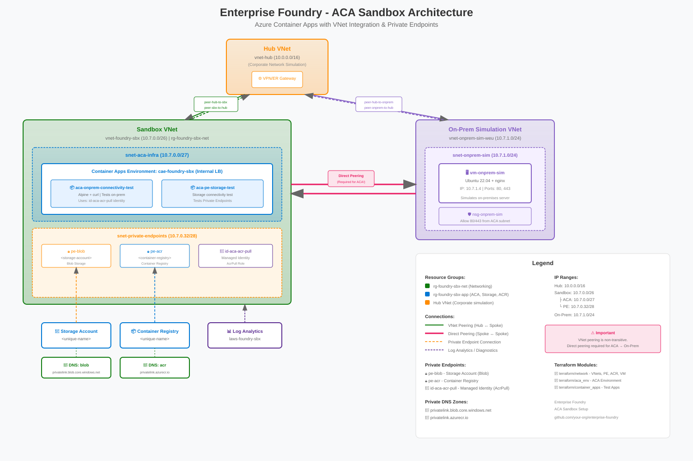

# Enterprise Foundry - Azure Container Apps Sandbox Setup

A Terraform-based infrastructure setup for deploying Azure Container Apps (ACA) with VNet integration, private endpoints, AI services, and hybrid connectivity simulation.

## 🏗️ Architecture



### Components

| Component | Description |
|-----------|-------------|
| **Hub VNet** | Simulates corporate hub network (Gateway & Firewall subnets ready) |
| **Sandbox VNet** | Contains ACA environment with VNet injection |
| **On-Prem Simulation VNet** | Ubuntu VM with nginx simulating on-premises servers |
| **Azure Container Apps** | VNet-injected container environment with internal load balancer |
| **AI Services** | Document Intelligence + AI Search with Private Endpoints |
| **Private Endpoints** | Secure access to Storage, ACR, Document Intelligence, AI Search |
| **Private DNS Zones** | DNS resolution for privatelink endpoints |
| **Direct VNet Peering** | Hub-spoke topology with direct spoke-to-spoke peering |

### Network Topology

```
                    ┌─────────────────┐
                    │    Hub VNet     │
                    │   10.0.0.0/16   │
                    └────────┬────────┘
                             │
              ┌──────────────┼──────────────┐
              │ VNet Peering │ VNet Peering │
              ▼              │              ▼
    ┌─────────────────┐      │     ┌─────────────────┐
    │  Sandbox VNet   │◄─────┴────►│  On-Prem Sim    │
    │  10.7.0.0/26    │  Direct    │  10.7.1.0/24    │
    │                 │  Peering   │                 │
    │  ┌───────────┐  │            │  ┌───────────┐  │
    │  │ ACA Env   │  │            │  │ Ubuntu VM │  │
    │  │ /27 subnet│  │            │  │  nginx    │  │
    │  └───────────┘  │            │  └───────────┘  │
    │  ┌───────────┐  │            └─────────────────┘
    │  │    PEs    │  │
    │  │ /28 subnet│  │
    │  └───────────┘  │
    └─────────────────┘
            │
            ▼
    ┌─────────────────────────────────────┐
    │          AI Services (PE)           │
    │  ┌──────────────┐ ┌──────────────┐  │
    │  │  Document    │ │  AI Search   │  │
    │  │ Intelligence │ │              │  │
    │  └──────────────┘ └──────────────┘  │
    └─────────────────────────────────────┘
```

> **Important**: VNet peering is non-transitive! Traffic cannot flow Hub→Sandbox→Hub→OnPrem. Direct peering between Sandbox and On-Prem VNets is required for ACA to reach simulated on-premises resources.

## 📋 Prerequisites

- Azure subscription with Owner/Contributor access
- WSL2 (Ubuntu) or Linux environment
- Azure CLI
- Terraform >= 1.5.0
- **Existing Hub VNet** (the network module peers to it but does not create it)

> **Note:** The Hub VNet must already exist in your Azure environment. The Terraform `network` module creates VNet peerings to the Hub but does not provision the Hub itself. If you don't have a Hub VNet, you can either:
> - Create one manually before deploying
> - Modify the `network` module to create it
> - Remove the Hub peering resources if not needed

### Install Prerequisites

```bash
./00_install_prerequisites.sh
```

This script installs or upgrades:
- Azure CLI
- Terraform

## 🚀 Quick Start

### 1. Clone and Configure

```bash
git clone <repository-url>
cd enterprise-foundry-aca-setup

# Copy example configs and customize
cp terraform/network/terraform.tfvars.example terraform/network/terraform.tfvars
cp terraform/aca_env/terraform.tfvars.example terraform/aca_env/terraform.tfvars
cp terraform/ai_services/terraform.tfvars.example terraform/ai_services/terraform.tfvars
cp terraform/container_apps/terraform.tfvars.example terraform/container_apps/terraform.tfvars

# Edit each terraform.tfvars with your values
```

### 2. Login to Azure

```bash
az login
az account set --subscription "<your-subscription-id>"
```

### 3. Deploy Infrastructure

Use the interactive Terraform executor:

```bash
./01_terraform.sh
```

**Menu options:**
- `1-4` - Toggle module selection
- `a` - Select all modules
- `p` - Plan (preview changes)
- `d` - Deploy selected modules
- `x` - Destroy selected modules
- `q` - Quit

**Deployment order** (handled automatically):
1. `network` - VNets, VMs, Storage, ACR, Private Endpoints
2. `aca_env` - Azure Container Apps Environment
3. `ai_services` - Document Intelligence, AI Search, Private Endpoints
4. `container_apps` - Test container applications

## 📁 Project Structure

```
enterprise-foundry-aca-setup/
├── 00_install_prerequisites.sh     # Install Azure CLI + Terraform
├── 01_terraform.sh                 # Interactive deployment script
├── architecture_diagram.svg        # Visual architecture diagram
├── terraform/
│   ├── network/                    # Core networking infrastructure
│   │   ├── main.tf
│   │   ├── variables.tf
│   │   ├── outputs.tf
│   │   └── terraform.tfvars.example
│   ├── aca_env/                    # Container Apps Environment
│   │   ├── main.tf
│   │   ├── variables.tf
│   │   ├── outputs.tf
│   │   └── terraform.tfvars.example
│   ├── ai_services/                # AI Services (Doc Intel, AI Search)
│   │   ├── main.tf
│   │   ├── variables.tf
│   │   ├── outputs.tf
│   │   └── terraform.tfvars.example
│   └── container_apps/             # Test container applications
│       ├── main.tf
│       ├── variables.tf
│       ├── outputs.tf
│       └── terraform.tfvars.example
└── tools/
    ├── monitor_onprem.sh           # Monitor VM connectivity test
    ├── monitor_storage.sh          # Monitor storage PE test
    └── generate_architecture_diagram.sh
```

## 🧪 Connectivity Tests

The `container_apps` module deploys two test applications:

### On-Prem Connectivity Test

Tests HTTP connectivity from ACA to the simulated on-premises VM.

```bash
./tools/monitor_onprem.sh
```

**Output:**
```
✅ [2024-01-30 12:00:00] onprem 10.7.1.4 port 80 TCP=FAIL HTTP=OK
✅ [2024-01-30 12:00:00] onprem 10.7.1.4 port 443 TCP=FAIL HTTP=OK
```

> **Note:** Only HTTP connectivity is tested (not raw TCP sockets). This is intentional - the test uses `curl` to verify HTTP-level connectivity, which is the typical use case for container apps communicating with backend services. The `TCP=FAIL` is expected because Alpine's `/dev/tcp` isn't available; the `HTTP=OK` confirms actual connectivity works.

### Storage Private Endpoint Test

Tests connectivity to Azure Storage via Private Endpoint using managed identity.

```bash
./tools/monitor_storage.sh
```

**Output:**
```
✅ [2024-01-30 12:00:00] Storage: mystorageaccount.blob.core.windows.net
   Private IP: 10.7.0.36 | Response: 299 bytes
```

## 🤖 Azure AI Foundry Setup (Portal)

Azure AI Foundry is set up manually via the Azure Portal, as it requires a Managed VNet that integrates with your existing AI Services.

### 1. Create AI Hub

1. Go to [ai.azure.com](https://ai.azure.com) → **Management** → **All hubs** → **+ New hub**
2. Configure:
   - **Hub name**: `hub-foundry-sbx`
   - **Resource group**: Same as `rg_app` (e.g., `rg-foundry-sbx-app`)
   - **Region**: Same as your Terraform deployment
   - **Azure AI services**: Create new or select existing
3. **Networking** tab:
   - Select **Private with Internet Outbound**
   - This creates a Managed VNet with automatic Private Endpoints
4. Review and create

### 2. Create AI Project

1. In AI Foundry portal → **+ New project**
2. Configure:
   - **Project name**: `project-foundry-sbx`
   - **Hub**: Select `hub-foundry-sbx`
3. Create project

### 3. Add Connections to AI Services

Connect your Terraform-deployed AI Services to AI Foundry:

1. In AI Foundry → **Management** → **Connected resources** → **+ New connection**
2. **Document Intelligence**:
   - Type: **Azure AI Services**
   - Select your `cog-docintel-*` resource
   - Authentication: **API Key** or **Managed Identity**
3. **AI Search**:
   - Type: **Azure AI Search**
   - Select your `search-*` resource
   - Authentication: **API Key** or **Managed Identity**

> **Note**: When you add connections, AI Foundry automatically creates Private Endpoints in its Managed VNet to reach your services securely.

### 4. Verify Connectivity

1. Go to **Playground** in AI Foundry
2. Test Document Intelligence by uploading a document
3. Test AI Search by creating/querying an index

## 🔌 AI Services Usage in Container Apps

The `ai_services` Terraform module creates a Managed Identity (`id-aca-ai-services`) with the necessary RBAC roles. Use this identity in your Container Apps to access AI Services.

### Environment Variables

After deploying `ai_services`, use the outputs in your Container Apps:

```bash
# Get outputs from ai_services module
cd terraform/ai_services
terraform output
```

**Available outputs:**

| Output | Description | Example |
|--------|-------------|---------|
| `docintel_endpoint` | Document Intelligence endpoint | `https://cog-docintel-xyz.cognitiveservices.azure.com/` |
| `docintel_id` | Resource ID for RBAC | `/subscriptions/.../cognitiveServices/cog-docintel-xyz` |
| `search_endpoint` | AI Search endpoint | `https://search-xyz.search.windows.net` |
| `search_id` | Resource ID for RBAC | `/subscriptions/.../searchServices/search-xyz` |
| `aca_ai_services_identity_id` | Managed Identity resource ID | `/subscriptions/.../userAssignedIdentities/id-aca-ai-services` |
| `aca_ai_services_identity_client_id` | Client ID for token requests | `xxxxxxxx-xxxx-xxxx-xxxx-xxxxxxxxxxxx` |

### Using in Container Apps

Add these environment variables to your Container App:

```hcl
# In container_apps/main.tf
resource "azurerm_container_app" "my_app" {
  # ... other config ...

  identity {
    type         = "UserAssigned"
    identity_ids = [data.azurerm_user_assigned_identity.ai_services.id]
  }

  template {
    container {
      # ... other config ...
      
      env {
        name  = "AZURE_CLIENT_ID"
        value = data.azurerm_user_assigned_identity.ai_services.client_id
      }
      env {
        name  = "DOCINTEL_ENDPOINT"
        value = "https://cog-docintel-xyz.cognitiveservices.azure.com/"
      }
      env {
        name  = "SEARCH_ENDPOINT"
        value = "https://search-xyz.search.windows.net"
      }
    }
  }
}
```

### Python SDK Example

```python
from azure.identity import ManagedIdentityCredential
from azure.ai.formrecognizer import DocumentAnalysisClient
from azure.search.documents import SearchClient

# Use the Managed Identity
credential = ManagedIdentityCredential(
    client_id=os.environ["AZURE_CLIENT_ID"]
)

# Document Intelligence
doc_client = DocumentAnalysisClient(
    endpoint=os.environ["DOCINTEL_ENDPOINT"],
    credential=credential
)

# AI Search
search_client = SearchClient(
    endpoint=os.environ["SEARCH_ENDPOINT"],
    index_name="my-index",
    credential=credential
)
```

## 🔧 Configuration Reference

### Required Variables

| Module | Variable | Description |
|--------|----------|-------------|
| All | `subscription_id` | Azure Subscription ID |
| All | `location` | Azure region (e.g., westeurope) |
| All | `rg_net` | Network resource group name |
| All | `rg_app` | Application resource group name |
| network | `storage_account_name` | Globally unique storage account name |
| network | `acr_name` | Globally unique container registry name |
| aca_env | `vnet_name` | Sandbox VNet name (from network module) |
| aca_env | `subnet_aca` | ACA subnet name (from network module) |
| ai_services | `docintel_name` | Globally unique Document Intelligence name |
| ai_services | `search_name` | Globally unique AI Search name |
| container_apps | `aca_env_name` | ACA environment name (from aca_env module) |
| container_apps | `storage_account_name` | Storage account name (from network module) |

### Network Address Spaces

| Network | CIDR | Purpose |
|---------|------|---------|
| Hub VNet | 10.0.0.0/16 | Corporate hub simulation |
| Sandbox VNet | 10.7.0.0/26 | ACA workloads |
| └─ ACA Subnet | 10.7.0.0/27 | Container Apps (min /27 required) |
| └─ PE Subnet | 10.7.0.32/28 | Private Endpoints |
| On-Prem VNet | 10.7.1.0/24 | On-premises simulation |

## 🗑️ Cleanup

Destroy in reverse order:

```bash
./01_terraform.sh
# Select modules in reverse order: container_apps → ai_services → aca_env → network
# Press 'x' to destroy
```

Or manually:

```bash
cd terraform/container_apps && terraform destroy
cd ../ai_services && terraform destroy
cd ../aca_env && terraform destroy
cd ../network && terraform destroy
```

> **Note**: ACA environment deletion can take 15-30 minutes due to Azure internal cleanup processes.

## ⚠️ Important Notes

### VNet Peering is Non-Transitive

Azure VNet peering does not allow transitive routing. If you have:
- Hub ↔ Sandbox (peered)
- Hub ↔ On-Prem (peered)

Traffic from Sandbox **cannot** reach On-Prem via Hub. You need **direct peering** between Sandbox and On-Prem VNets.

### ACA Subnet Requirements

- Minimum subnet size: **/27** (32 addresses)
- Must be delegated to `Microsoft.App/environments`
- Cannot be shared with other resources

### Managed Identity in ACA

Container Apps use a different token endpoint than VMs:
- ❌ `169.254.169.254` (VM metadata endpoint - doesn't work)
- ✅ `$IDENTITY_ENDPOINT` with `$IDENTITY_HEADER` (ACA environment variables)

## 📄 License

MIT License - feel free to use and modify for your projects.

## 🤝 Contributing

1. Fork the repository
2. Create a feature branch
3. Submit a pull request

---

**Built with** ❤️ **using Terraform and Azure**
